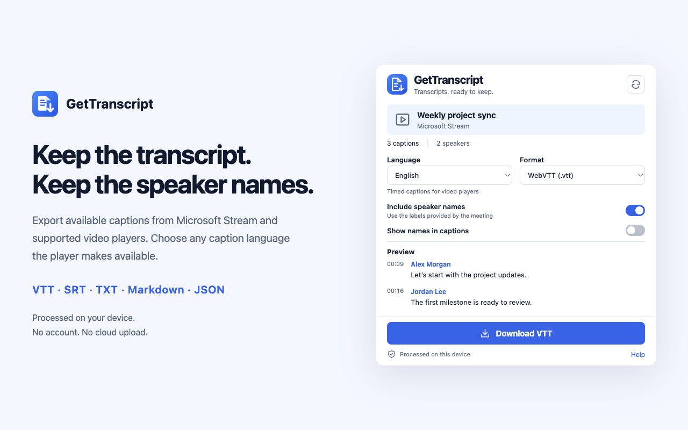

# GetTranscript

**Keep the transcript. Keep the speaker names.**

GetTranscript turns the captions already available on a video page into a file you can keep, edit, search or reuse. Open the extension, choose your format, and download.

Current version: **v1.2.0** · Chrome and Microsoft Edge · Manifest V3



## A useful transcript in one place

- **Five formats:** WebVTT, SRT, plain text, Markdown and structured JSON.
- **Speaker names:** preserve existing caption voice tags and match Microsoft Stream transcript labels using complete text and timestamps.
- **Precise timing:** preserve millisecond start and end times, including overlapping speakers.
- **Detected language:** one caption track appears as read-only information; multiple tracks get a language selector. All readable languages exposed by the supported player are supported, including right-to-left scripts.
- **Readable subtitles:** optionally display speaker names in VTT caption text; SRT uses visible names when speaker inclusion is enabled.
- **Small, focused interface:** preview the first captions, remember format preferences, and get a clear result when a download completes.

## Install locally

Download the package from [GitHub Releases](https://github.com/RobinMJD/GetTranscript/releases). Install from [Microsoft Edge Add-ons](https://microsoftedge.microsoft.com/addons/detail/gocppcckockjkjbiefaobloabljddpfn). Version 1.2.0 was submitted to the Chrome Web Store on September 20, 2026 and is pending review, with automatic publication after approval.

1. Extract `gettranscript-v1.2.0-chromium-stores.zip` into a permanent folder.
2. Open `chrome://extensions` or `edge://extensions` and enable **Developer mode**.
3. Select **Load unpacked** and choose that extracted folder. Its root contains `manifest.json`.
4. Pin GetTranscript to the toolbar.

For source builds, load `dist/` after running the commands below.

## Use it

1. Open the original video page and select GetTranscript in the toolbar.
2. Let it read the captions and match speaker names. You can close the popup; the job continues. Reopen it to see the same result.
3. Choose the format and speaker options. A language selector appears only when multiple caption tracks are available.
4. Select **Download**. The file is saved through your browser’s download manager.

If no captions are found, turn captions on in the player and refresh GetTranscript. For a video embedded from another origin, open the video’s original page.

| Format   | Best for                                     | Speaker names                                |
| -------- | -------------------------------------------- | -------------------------------------------- |
| VTT      | Web video and caption tooling                | Standard voice tags; optional visible prefix |
| SRT      | Video editors and broad player compatibility | Visible prefix                               |
| TXT      | Reading, search and copying into documents   | Timestamp and visible name                   |
| Markdown | Notes and documentation                      | Timestamp and bold speaker heading           |
| JSON     | Other tools and processing pipelines         | Optional `speaker` field; numeric seconds    |

## Supported pages and limits

**Microsoft Stream on SharePoint:** standard recording pages with readable caption tracks. The transcript adapter uses structural controls, numeric timestamps and locale-derived metadata, and collects virtualized rows without assuming that the first screen is the whole meeting. There is no language whitelist; the interface remains in English.

**Other HTML5 video and audio players:** readable WebVTT resources or native text tracks. Same-origin frames are inspected. Cross-origin embedded players should be opened separately. Proprietary players, closed shadow roots and sites that do not expose captions are not covered.

GetTranscript does not transcribe audio, identify voices, translate text or correct the meeting service’s speaker assignments. Names are added only after a unique text-and-time match. Unmatched captions remain unnamed and partial coverage is reported. A live player may expose only a rolling window of captions rather than the complete event.

## Local processing

- No developer server, analytics, account registration, AI service or cloud upload.
- No persistent access to all websites, cookie access, browsing history or debugger permission.
- Format and speaker preferences are saved in local extension storage.
- Per-tab transcripts, selected tracks and download status stay in temporary browser session memory, so closing the popup does not lose them. Refresh replaces that tab’s session; closing the source tab clears it. Browser restart, extension reload/update or disabling the extension also clears these sessions.
- Changing the video within an existing tab keeps the previous result until you press Refresh. Downloaded files remain under your control.
- Referenced caption resources may be loaded directly from the page or its caption host, with normal browser access restrictions.
- Stream controls may briefly open, select captions or scroll during collection, then return to their previous state.

Read [Privacy](PRIVACY.md), [Security](SECURITY.md) and [Terms](TERMS.md).

## Build and verify

Use Node.js 22.12 or later; CI uses Node 24. Dependencies are pinned by `package-lock.json`.

```sh
npm ci
npm run verify
npx playwright install chromium
npm run test:browser
npm run test:toolbar
npm audit --audit-level=low
npm run package:stores
```

`npm run dev` opens the development server. `/?demo` enables a development-only popup with fictional data. Demo data is removed from production and the package verifier checks for accidental inclusion.

The browser suite loads a production build into an isolated Chromium profile. Fixture-only host permissions and tab selection are supplied by the harness because a tab-rendered popup does not receive a real toolbar click. Extraction, MAIN-world execution, local preference storage and download APIs run unchanged. The distributable manifest is checked separately and contains no fixture permissions. Use `BROWSER_BIN=/path/to/chrome-for-testing` to select an existing compatible test browser.

The separate `test:toolbar` suite opens the actual browser toolbar popup in an isolated profile, measures its native size and checks loaded, empty, restricted and download-error states. Run it with Chrome for Testing and Edge using `BROWSER_BIN`. On Linux, use `xvfb-run -a npm run test:toolbar`. `TOOLBAR_SCALE=1.5` checks display scaling; `TOOLBAR_ARTIFACTS=/path/to/qa` saves screenshots.

## Release process

One deterministic Chromium ZIP is used unchanged for GitHub Releases, Chrome Web Store and Edge Add-ons. Its root manifest, permissions, required files, version and absence of demo data are checked before release. Rebuilding identical inputs produces identical package bytes.

The release workflow requires an exact `vX.Y.Z` tag on `main`, verifies the version, runs unit, loaded-browser and actual-toolbar tests, audits dependencies and packages once. Publication jobs consume that verified artifact. Store jobs remain disabled until their listing identities and protected environment credentials have been configured. Manual reruns can select GitHub, Chrome or Edge independently.

See [Publishing](docs/PUBLISHING.md), [Store listing](docs/STORE_LISTING.md) and [Architecture](docs/ARCHITECTURE.md). [GitHub Releases](https://github.com/RobinMJD/GetTranscript/releases) is the canonical published changelog. No Store links or installation badges are shown until their actual listings exist.

## Project layout

```text
src/extractor/   Page-local caption and transcript collection
src/lib/         Parsing, exact speaker matching, formats and browser APIs
src/background.ts  Background collection, downloads and session events
src/lib/session.ts Per-tab job lifecycle and temporary state
src/popup/       Popup UI and development-only sample data
tests/          Conversion regressions and isolated loaded-extension tests
scripts/        Build, version checks, packaging and Store publication
public/         Manifest, local help and icons
.github/        CI and release workflows
docs/           Architecture, Store materials and publishing guidance
```

The release conventions follow QuickPIM++ and UseMyCurrentAccount++. See [Credits](docs/CREDITS.md).
