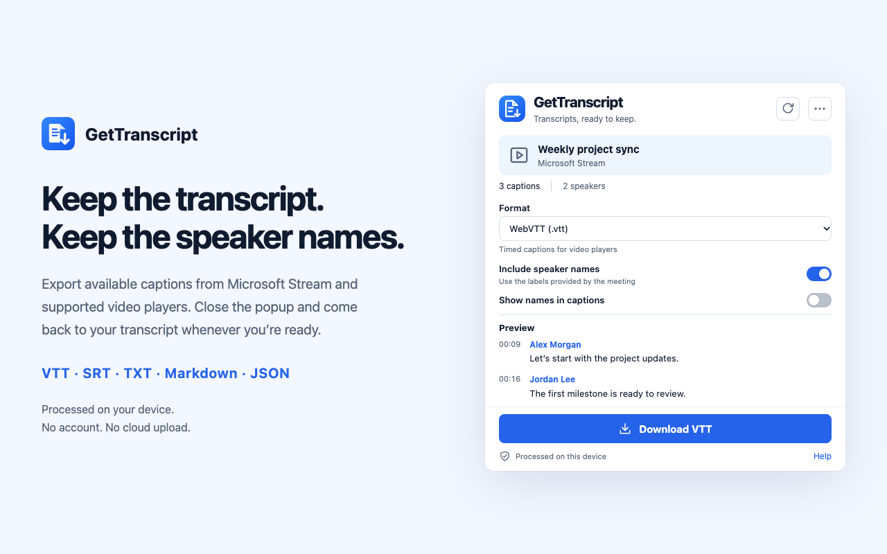
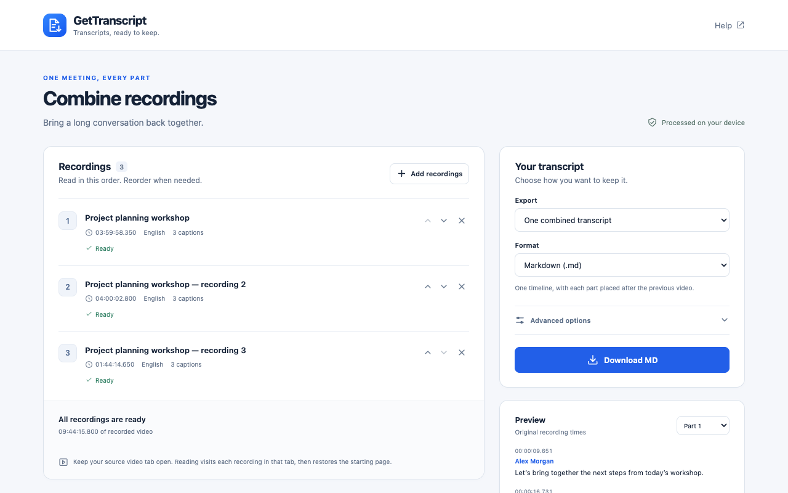

# GetTranscript

**Keep the transcript. Keep the speaker names.**

GetTranscript turns the captions already available on a video page into a file you can keep, edit, search or reuse. Open the extension, choose your format, and download.

Current version: **v1.3.1** · Chrome and Microsoft Edge · Manifest V3



## A useful transcript in one place

- **Five formats:** WebVTT, SRT, plain text, Markdown and structured JSON.
- **Speaker names:** preserve names supplied directly by Microsoft Stream and existing caption voice tags; match transcript-panel labels using complete text and timestamps when needed.
- **Precise timing:** preserve millisecond start and end times, including overlapping speakers.
- **Multilingual transcripts:** preserve the original text even when spoken languages change during a recording. A caption track selector appears only when the player offers multiple separate tracks; all readable languages and right-to-left scripts are supported.
- **Readable subtitles:** optionally display speaker names in VTT caption text; SRT uses visible names when speaker inclusion is enabled.
- **Small, focused interface:** preview the first captions, remember format preferences, and get a clear result when a download completes.
- **Meetings split into recordings:** collect up to 20 parts in a separate workspace, then export one combined transcript or a ZIP of individual files.

## Install locally

Published versions are available from the [Chrome Web Store](https://chromewebstore.google.com/detail/gjmfapccgoioohohinpdladdjkfnlclk), [Microsoft Edge Add-ons](https://microsoftedge.microsoft.com/addons/detail/gocppcckockjkjbiefaobloabljddpfn) and [GitHub Releases](https://github.com/RobinMJD/GetTranscript/releases). Store updates become available after their respective review processes; the public listing may temporarily show an earlier version.

1. Extract the chosen `gettranscript-vX.Y.Z-chromium-stores.zip` release package into a permanent folder.
2. Open `chrome://extensions` or `edge://extensions` and enable **Developer mode**.
3. Select **Load unpacked** and choose that extracted folder. Its root contains `manifest.json`.
4. Pin GetTranscript to the toolbar.

For source builds, load `dist/` after running the commands below.

## Use it

1. Open the original video page and select GetTranscript in the toolbar.
2. Let it read the captions and available speaker names. You can close the popup; the job continues. Reopen it to see the same result.
3. Choose the format and speaker options. A **Caption track** selector appears only when multiple separate tracks are available.
4. Select **Download**. The file is saved through your browser’s download manager.

If no captions are found, turn captions on in the player and refresh GetTranscript. For a video embedded from another origin, open the video's original page.

| Format   | Best for                                     | Speaker names                                |
| -------- | -------------------------------------------- | -------------------------------------------- |
| VTT      | Web video and caption tooling                | Standard voice tags; optional visible prefix |
| SRT      | Video editors and broad player compatibility | Visible prefix                               |
| TXT      | Reading, search and copying into documents   | Timestamp and visible name                   |
| Markdown | Notes and documentation                      | Timestamp and bold speaker heading           |
| JSON     | Other tools and processing pipelines         | Optional `speaker` field; numeric seconds    |

## Combine a meeting’s recordings

Open the popup’s **More options → Combine recordings** workspace. Add up to 20 recording links from the same website as the source tab, or use **Find links on source** to choose Stream links already exposed by that page. The extension does not guess filenames or search a recording library. Check the order, choose each part’s available caption track, and select **Read recordings**.

Keep the source video tab open: collection visits each recording in that tab, then restores its starting page and player state unless you have navigated elsewhere. Reading continues if you close the workspace. Reopen it from the popup to see progress, pause and continue, or retry a failed part. Refresh collection keeps its links, order and options while clearing captured content for a fresh read. Incomplete parts must be retried or explicitly removed before export.

Progress distinguishes waiting for the source tab, opening a recording, reading captions and restoring the starting page. Pause cancels a collection that is still waiting for the tab immediately; an active reading step finishes safely before pausing. New collections inherit your saved popup format and speaker preferences. You can change the export format while recordings are being read; it applies when you download.

Slow Stream players get up to 45 seconds to expose their controls and captions, with supported Transcript controls opened automatically. If a part still needs attention, use **Open recording** to bring its source tab forward, open **Transcript**, then return and choose **Retry this part**. Retry reads an already-open recording without reloading it, preserving manual preparation and previously completed parts.

Choose **One combined transcript** in any of the five formats, or **Separate files (.zip)** to keep each recording’s original timestamps. Advanced timeline options are:

- **Join end to end:** uses actual video durations, including silence. It does not infer pauses between recordings.
- **Set start times:** enter each part’s start as `HH:MM:SS.mmm` or seconds to preserve known gaps. Parts must not overlap.
- **Keep each part’s original times:** available for combined Markdown, text and JSON. Combined VTT/SRT use a shared timeline; individual subtitle files retain local times.



Speaker labels are resolved separately within each recording before combining. Recordings combine even when spoken languages or caption-track language tags differ; the original text is preserved without translation. Markdown, text and JSON can include recording links. Combined JSON uses schema version 2, with per-part metadata, local cue timings and timeline offsets; single-recording JSON remains schema version 1.

Some recordings report caption ends slightly beyond their video duration. Overhangs of up to 5 seconds are preserved with a timing warning; no captions are trimmed and the next part still starts after the reported video duration. Larger overhangs block a shared timeline until the recording is refreshed or exported with original timestamps. Separate files remain available.

## Supported pages and limits

**Microsoft Stream on SharePoint:** standard recording pages with readable transcripts. GetTranscript first reads structured transcript data for the current recording, including native speaker names, without scrolling transcript rows. If that data is unavailable, it uses the player's caption tracks and transcript panel. There is no language whitelist; the interface remains in English. A transcript containing several spoken languages remains together. Track language tags are source metadata, not a claim about the language of every caption.

**Other HTML5 video and audio players:** readable WebVTT resources or native text tracks. Same-origin frames are inspected. Cross-origin embedded players should be opened separately. Proprietary players, closed shadow roots and sites that do not expose captions are not covered.

GetTranscript does not transcribe audio, identify voices, translate text or correct the meeting service’s speaker assignments. It preserves names already attached to captions; additional panel labels require a unique text-and-time match. Unmatched captions remain unnamed and partial coverage is reported. A live player may expose only a rolling window of captions rather than the complete event.

Structured Stream reads have bounded requests and do not depend on virtualized rows becoming visible. The player fallback opens closed transcript controls when needed and reads long rows in resumable chunks of about 18 seconds, restoring controls between chunks. Some players do not render further rows in a background tab; the fallback reports incomplete speaker coverage instead of claiming all names were read. Each active capture invocation has a 10-minute budget; continuing a paused job gets a fresh budget. Collection and export are bounded to 50,000 cues and 5 million text characters, and temporary-storage limits still apply.

## Local processing

- No developer server, analytics, account registration, AI service or cloud upload.
- No persistent access to all websites, cookie access, browsing history or debugger permission.
- Format and speaker preferences are saved in local extension storage.
- Per-tab transcripts, collections, canonical recording URLs, selected tracks, progress checkpoints and download status stay in temporary browser session memory. Refresh replaces the corresponding cached result; closing the source tab clears its results and collection. Browser restart, extension reload/update or disabling the extension also clears these sessions.
- Reopening the popup after navigating to another recording checks its source identity and reads the new recording. Downloaded files remain under your control.
- Referenced caption resources and the current Stream recording's transcript data may be loaded directly from their existing host, using the page's existing access. Authentication values are never saved in extension storage or included in exports.
- Stream controls may briefly open, select captions or scroll during collection, then return to their previous state.

Read [Privacy](PRIVACY.md), [Security](SECURITY.md) and [Terms](TERMS.md).

## Build and verify

Use Node.js 22.12 or later; CI uses Node 24. Dependencies are pinned by `package-lock.json`.

```sh
npm ci
npm run verify
npx playwright install chromium
npm run test:browser
npm run test:toolbar
npm audit --audit-level=low
npm run package:stores
```

`npm run dev` opens the development server. `/?demo` enables a development-only popup with fictional data. Demo data is removed from production and the package verifier checks for accidental inclusion.

The browser suite loads a production build into an isolated Chromium profile. Fixture-only host permissions and tab selection are supplied by the harness because a tab-rendered popup does not receive a real toolbar click. Extraction, MAIN-world execution, local preference storage and download APIs run unchanged. The distributable manifest is checked separately and contains no fixture permissions. Use `BROWSER_BIN=/path/to/chrome-for-testing` to select an existing compatible test browser.

The separate `test:toolbar` suite opens the actual browser toolbar popup in an isolated profile, measures its native size and checks loaded, empty, restricted and download-error states. Run it with Chrome for Testing and Edge using `BROWSER_BIN`. On Linux, use `xvfb-run -a npm run test:toolbar`. `TOOLBAR_SCALE=1.5` checks display scaling; `TOOLBAR_ARTIFACTS=/path/to/qa` saves screenshots.

## Release process

Release candidates are tested as local sideload builds before publication. Store submission and public availability are verified separately for each browser.

One deterministic Chromium ZIP is used unchanged for GitHub Releases, Chrome Web Store and Edge Add-ons. Its root manifest, permissions, required files, version and absence of demo data are checked before release. Rebuilding identical inputs produces identical package bytes.

The release workflow requires an exact `vX.Y.Z` tag on `main`, verifies the version, runs unit, loaded-browser and actual-toolbar tests, audits dependencies and packages once. Publication jobs consume that verified artifact. Store jobs remain disabled until their listing identities and protected environment credentials have been configured. Manual reruns can select GitHub, Chrome or Edge independently.

See [Publishing](docs/PUBLISHING.md), [Store listing](docs/STORE_LISTING.md) and [Architecture](docs/ARCHITECTURE.md). [GitHub Releases](https://github.com/RobinMJD/GetTranscript/releases) is the canonical published changelog. The public Store listings may update at different times while reviews complete.

## Project layout

```text
src/extractor/   Page-local caption and transcript collection
src/lib/         Parsing, exact speaker matching, formats and browser APIs
src/background.ts  Background collection, downloads and session events
src/lib/session.ts Per-tab job lifecycle and temporary state
src/lib/collection.ts Multipart models, timeline validation and export
src/lib/collection-session.ts Collection queue, checkpoints and lifecycle
src/popup/       Popup UI and development-only sample data
src/collection/  Combine-recordings workspace
tests/          Conversion regressions and isolated loaded-extension tests
scripts/        Build, version checks, packaging and Store publication
public/         Manifest, local help and icons
.github/        CI and release workflows
docs/           Architecture, Store materials and publishing guidance
```

The release conventions follow QuickPIM++ and UseMyCurrentAccount++. See [Credits](docs/CREDITS.md).
